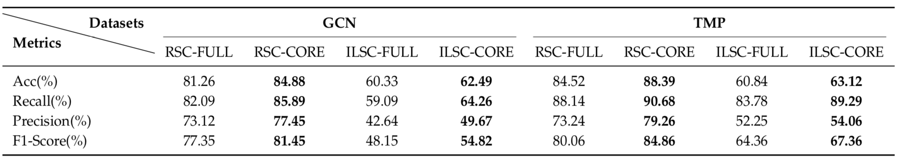
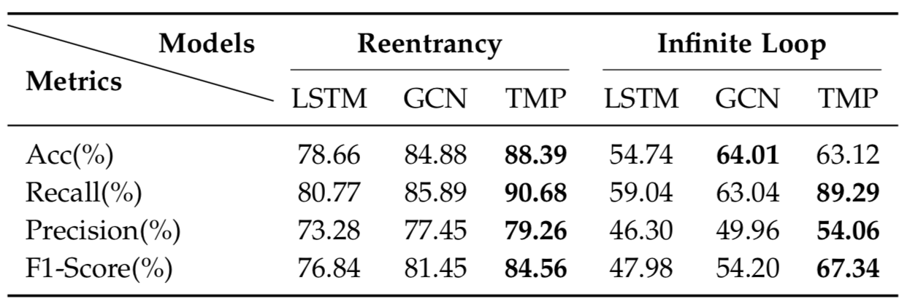
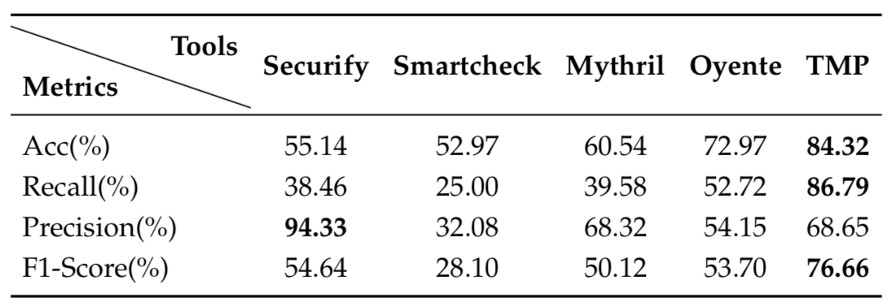

# GGNNSmartVulDetector

This repository is a python implementation of smart contract vulnerability detection based on gated graph neural network (GGNN). 
In this research work, we focus on detecting two kinds of smart contract vulnerabilities (i.e., reentrancy and infinite loop), 
which are not only the most significant threat to contract security but also challenging to precisely identify. 
All of the infinite loop types we concerned are [Vntchain](https://github.com/vntchain/go-vnt) smart contracts written by Class C/C++, 
while the reentrancy smart contracts of [Ethereum](https://etherscan.io/) written by Solidity.
Ethereum is a decentralized blockchain platform that can build a broad scope of applications, while Ether is one kind of cryptocurrency used on this platform.
Vntchain is an open-source distributed value network, which is a novel and evolutionary blockchain platform.

We conduct extensive experiments on two datasets (RSC and ILSC) that we plan to open-source, i.e. 40932 real-world Ethereum and 1,317 Vntchain smart contracts respectively. We are the first to use graph neural networks (GNNs) to detect smart contract vulnerabilities and provide insights into the challenges in smart contracts vulnerability detection using deep learning.
The details of model training and results of model evaluation are given below.

## Requirements

#### Required Packages
* **python**3
* **TensorFlow**1.14.0
* **keras**2.2.4 with TensorFlow backend
* **sklearn** for model evaluation
* **docopt** as a command-line interface parser 
* **go-vnt** as a vntchain platform support
* **go-ethereum** as a ethereum platform support

Run the following script to install the required packages.
```shell
pip install --upgrade pip
pip install --upgrade tensorflow
pip install keras
pip install scikit-learn
pip install docopt
```

### Required Dataset
This repository contains two targeted available datasets: Reentrancy of Smart Contract (RSC) and Infinite Loop of Smart Contract (ILSC). 
(a) Reentrancy of Smart Contract. RSC is an Ethereum smart contract dataset assembled by ourselves. We collect a large-scale real-world data of 40932 smart contracts with verified source code from Etherscan as of August 5, 2018, of which 1671 smart contracts contain external function calls (i.e., “call”) that are easily subjected to reentrancy attacks. 
This dataset is used for smart contract reentrancy vulnerability detection to validate the effectiveness of our method. 
(b) Infinite Loop of Smart Contract. ILSC is another smart contract dataset based on Vntchain platform. 
We create and collect 1317 smart contracts, which those with infinite loop almost account for half of the total. 
This dataset serves as additional support to ensure that the experiment can fully demonstrate the versatility of our approach. 
Overall, ILSC is more difficult than RSC due to its high number of types and more complicated features.

Furthermore, to evaluate the availability of our proposed elimination process, we adopt different representations of 
the two datasets for the input to neural networks, w.r.t. full-node embeddings without elimination and core-node embeddings 
with elimination. As a result, RSC was transited to RSC-FULL and RSC-CORE, while ILSC was transformed to ILSC-FULL and ILSC-CORE, 
respectively. Afterward, each dataset is divided into a training set and testing set in the proportion of 8:2. 
TABLE below summarizes the statistics, where the third column reveals the number of code snippets (i.e., code lines extracted from the smart contracts). 

|  | Training set | Testing set | Code snippets | Nodes | Edges |
| ------------- | ------------- | ------------- | ------------- |  ------------- |  ------------- |
| **RSC-FULL** | 1341 | 336 | 4206 | 8301 | 4760 |
| **RSC-CORE** | 1341 | 336 | 4206 | 5877 | 4760 |
| **ILSC-FULL**| 1054 | 263 | 3082 | 4854 | 3632 |
| **ILSC-CORE** | 1054 | 263 | 3082 | 3082 | 3632 |


### Data structure
All of the source code of Vntchain smart contracts and graph dataset in these folders shown in the following structure respectively.
```shell
${GGNNSmartVulDetector}
├── data
│   ├── infinite_loop
│   │   └── contract
│   │   └── graph_data
│   └── reentrancy
│       └── contract
│       └── graph_data
├── train_data
    ├── infinite_loop
    │   └── train_corenodes.json
    │   └── train_fullnodes.json
    │   └── vaild_corenodes.json
    │   └── vaild_fullnodes.json
    └── reentrancy
        └── train_corenodes.json
        └── train_fullnodes.json
        └── vaild_corenodes.json
        └── vaild_fullnodes.json
        └── test_corenodes.json

```

* `data/reentrancy/contract`:  This is the dataset of original smart contracts.
* `data/reentrancy/graph_data`: This is the dataset, which it can be used to train for our proposed model. Among them, it includes the nodes and edges that are extracted by AutoExtractor.
* `graph_data/edge`: It includes all edges and edge attributes of each smart contract graph structure.
* `graph_data/node`: It includes all nodes and node attributes of each smart contract graph structure.
* `train_data/reentrancy/train_corenodes.json`: This is the feature vector of core points after feature ablation for training.
* `train_data/reentrancy/train_fullnodes.json`: This is the feature vector of full points without feature ablation for training.

### Code Files
The tools and models are as follows:
```shell
${GGNNSmartVulDetector}
├── tools
│   ├── remove_comment.py
│   ├── construct_fragment.py
│   ├── AutoExtractGraph.py
│   └── graph2vec.py
├── GGNNChemModel.py
├── BasicChemModel.py
└── utils.py
```

`GGNNChemModel.py`
* Interface to project, uses functionality from other code files.
* Loads dataset, trains gcn model, passes to neural network, models evaluation.
* Specific implementation for GGNN model 

`BasicChemModel.py`
* Basically model of GNN.
* Basically hyper-parameters for GNN.

`utils.py`
* The general tools for adjusting the iteration of models.

`AutoExtractGraph.py`
* All functions in the smart contract code are automatically split and stored.
* Find the relationships between functions.
* Extract all smart contracts source code into features of nodes and edges.

`graph2vec.py`
* Feature ablation.
* Converts graph into vectors.


**Note:** The graph structure automation extraction tool is being improved.


## Running project
* To run the program, use this command: python GGNNChemModel.py.
* Also, you can use specific hyper-parameters to train the model, which can be found in `GGNNChemModel.py` and `BasicChemModel.py`.

Examples:
```shell
python GGNNChemModel.py --random 9930 --thresholds 0.4
```

Using script：
Repeating 10 times for different seeds with `*_seed.sh`.
```shell
for i in $(seq 1 10);
do seed=$(( (RANDOM % 10000) + 1 ));
python ./GGNNChemModel.py --random_seed $seed --thresholds 0.4 | tee */SVDetector_"$i".log;
done
```
Repeating for different thresholds with `*_threshold.sh`.
```shell
for i in 0.0 0.1 0.2 0.3 0.4 0.5 0.6 0.7 0.8 0.9 1.0;
do
python ./GGNNChemModel.py --random_seed 9930 --thresholds $i | tee */SVDetector_"$i".log;
done
```
Then, you can find the training results in the `logs`.


## Models and Results
### Baselines
We implemented our proposed model with TensorFlow. We compared with the following competitive open-source smart contract vulnerability detection tools on the reentrancy detection task.

**Oyente**: This is a well-known security detection tool, which performs automatically analysis to reveal security vulnerabilities in Ethereum smart contracts.

**Mythril**: This is an automated security analysis tool, which uses Concolic analysis, taint analysis and control flow checking to detect a variety of security vulnerabilities in Ethereum smart contracts.

**Smartcheck**: This is an extensible static code analyzer for Ethereum smart contracts to runs analysis in Solidity source code and automatically checks smart contracts for security vulnerabilities and bad practices.

**Securify**: This is an automated formal security analysis tool to detect a variety of vulnerabilities (e.g., locked money, reentrancy, and others), which checks compliance and violation patterns to filter false positives.

Besides the aforementioned tools, we also compare our TMP network with the prior neural network-based approaches on the detection tasks encompassing reentrancy detection and infinite Loop detection (As Vntchain is a novel blockchain platform, there is currently no available tool for its vulnerability detection).

**LSTM**: One open-ended baseline solution is taking smart contracts as sequences and applies LSTM to learn dense sequence representations, which has wide applications in language modeling, neural machine translation, and image captioning. The idea of LSTM is to capture the sequential pattern of input data by incrementally consuming sequential data over time.

**GCN**: As programs are non-sequential across different functions, LSTM ignores structural information of programs, e.g., the data flow and invocation relations. Another challenge is that the performance of LSTM deteriorates on long sequences. We further consider methods incorporating the structural inductive bias. GCN can capture the structure information of the whole smart contract, in which the smart contract is converted into a graph structure. We also observe that smart contracts’ data-flow graphs express rich information about their security properties since the infamous DAO bug is just based on the data-flow pattern. Thus, an alternative method for vulnerability detection is taking the data-flow graphs and incorporating graph structure information.

### Result of the graph elimination process tested on two kinds of datasets COREs and FULLs
Technically speaking, our TMP network enhances the hierarchical structures presented in the graph of smart contracts via the elimination process. To further demonstrate the efficacy of our designed elimination process, we adopt two kinds of graph representations (i.e., FULLs and COREs) to compare the performance of elimination on our proposed TMP network.
Specifically, we test the elimination effect on two pairs of datasets: RSC-FULL and RSC-CORE, ILSC-FULL and ILSC-CORE, on two kinds of graph neural network models: GCN and TMP (our proposed model). All the performance results are summarized in TABLE below.

<div align=center></div>

### Result of deep neural net- work models, LSTM, GCN, and TMP
To evaluate the performance of different deep learning models, we employ convincing metrics including accuracy, recall, precision, and F1-Score. The experiments are conducted on the COREs and the comparison results are summarized in TABLE below.

<div align=center></div>

### Result of Ethereum smart contract detection tools in terms of reentrancy
Since there are no available tools for smart contract infinite loop detection, we here conduct further experiments to examine whether better performance can be achieved than state-of-the-art smart contract vulnerability detection tools on the reentrancy task. To quantify the performance comparison results, we list the accuracy, recall, precision, and, F1-Score in TABLE below, respectively. We scan 185 subject smart contracts (including 53 vulnerable reentrancy contracts) by these contract analyzers, for which we have already classified all warnings into false positive. 

<div align=center></div>


## References
1. VNT Document. [vnt-document](https://github.com/vntchain/vnt-documentation).
2. Graph classification with Graph Convolutional Networks in PyTorch. [graph_nn](https://github.com/bknyaz/graph_nn).
3. Smart contract vulnerability detection based on graph neural network (GCN). [GraphDeeSmartContract](https://github.com/Messi-Q/GraphDeeSmartContract).
4. Thomas N. Kipf, Max Welling, Semi-Supervised Classification with Graph Convolutional Networks, ICLR 2017. [GCN](https://arxiv.org/abs/1609.02907).
5. Li Y, Tarlow D, Brockschmidt M, et al. Gated graph sequence neural networks. ICLR, 2016. [GGNN](https://arxiv.org/abs/1511.05493)


